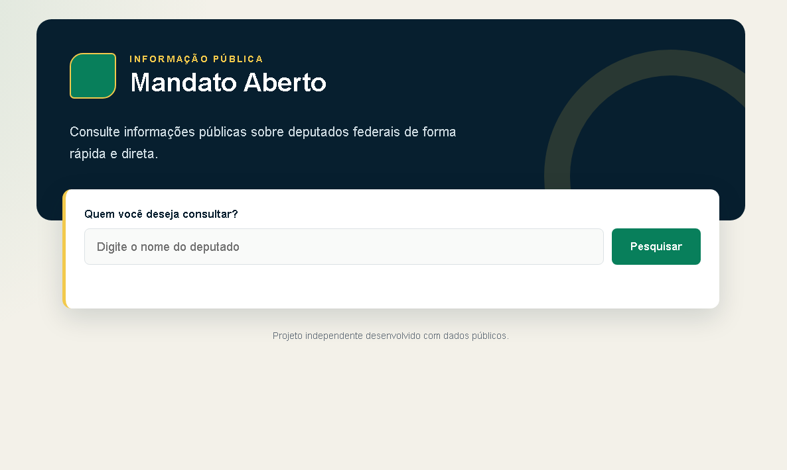
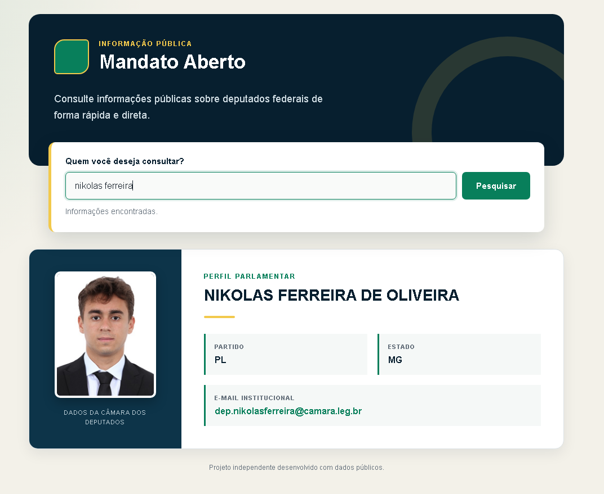

Mandato Aberto

Uma aplicação web para consultar informações públicas sobre deputados federais brasileiros de maneira simples e direta.

O projeto utiliza a API de Dados Abertos da Câmara dos Deputados para apresentar informações atualizadas sobre cada parlamentar.

Funcionalidades
Pesquisa de deputados pelo nome parlamentar.
Exibição da foto do deputado.
Consulta do nome civil.
Exibição do partido e estado.
Consulta do e-mail institucional.
Tratamento de deputados não encontrados.
Tratamento de erros na comunicação com a API.
Interface responsiva para computadores e celulares.
Tecnologias utilizadas
HTML
CSS
JavaScript
Fetch API
API de Dados Abertos da Câmara dos Deputados

O projeto foi desenvolvido sem frameworks ou bibliotecas visuais externas.

Estrutura do projeto
deputados/
├── index.html
├── style.css
├── script1.js
└── README.md
Como executar

Clone o repositório:

git clone https://github.com/DutraBrun0/Mandato-aberto.git

Entre na pasta do projeto:

cd Mandato-aberto

Abra a pasta no Visual Studio Code:

code .

Depois, abra o arquivo index.html no navegador. Também é possível executar o projeto utilizando a extensão Live Server do Visual Studio Code.

O projeto não precisa de instalação de dependências.

Como utilizar
Digite o nome de um deputado federal.
Clique no botão Pesquisar.
Aguarde a consulta na API.
Visualize as informações públicas do parlamentar.

Quando existem vários resultados com nomes parecidos, a aplicação apresenta o resultado mais próximo da pesquisa.

Fonte dos dados

Todas as informações são obtidas através da API oficial de Dados Abertos da Câmara dos Deputados:

https://dadosabertos.camara.leg.br/

Este é um projeto independente e não possui vínculo oficial com a Câmara dos Deputados.

Conhecimentos aplicados

Durante o desenvolvimento deste projeto foram aplicados conhecimentos de:

Consumo de APIs REST.
Requisições assíncronas com async e await.
Manipulação do DOM.
Tratamento de erros com try e catch.
Validação de dados.
Criação de interfaces responsivas.
HTML semântico.
Organização de código front-end.

Autor

Desenvolvido por Bruno Dutra.

GitHub: https://github.com/DutraBrun0
LinkedIn: https://www.linkedin.com/in/brunodutraaa/

Projeto desenvolvido para fins de estudo e portfólio.
